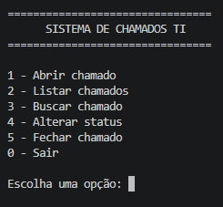

# Sistema de Chamados de TI
<p>
  
</p>

<p>
  Projeto desenvolvido em C# com o objetivo de simular um sistema básico de gerenciamento de chamados de suporte técnico.
</p>
Projeto desenvolvido em C# com o objetivo de simular um sistema básico de gerenciamento de chamados de suporte técnico.

## Funcionalidades

- Abrir chamados
- Listar chamados
- Buscar chamados por ID
- Alterar status dos chamados
- Fechar chamados
- Geração automática de ID
- Cadastro de solicitante
- Definição de categoria
- Definição de prioridade
- Validação de entradas

## Tecnologias utilizadas

- C#
- .NET
- Visual Studio Code

## Conceitos praticados

- Programação Orientada a Objetos (POO)
- Classes e objetos
- Listas (`List`)
- Métodos
- Estruturas condicionais (`if/else`)
- Estrutura de repetição (`while`)
- Laço `foreach`
- Entrada e saída de dados pelo console
- Validação de dados
- Manipulação de objetos

## Como executar

1. Clone o repositório.
2. Abra a pasta do projeto no Visual Studio Code.
3. Execute o seguinte comando no terminal:

```bash
dotnet run